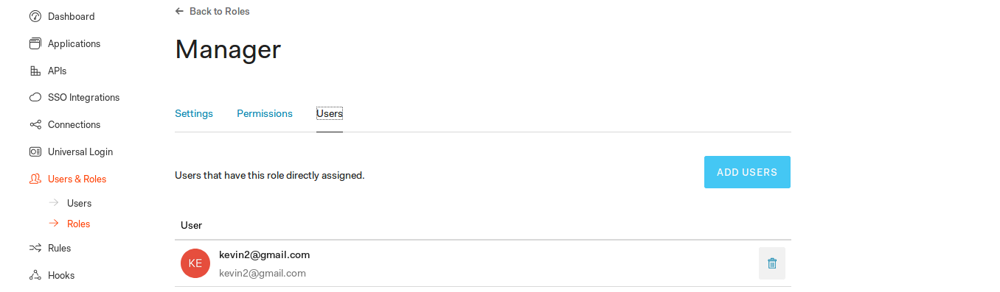

# Coffee Shop Full Stack

## Errors

The following command always has errors  `pip install -r requirements.txt` it is the command below which will work on my machine

- ```pip3 install -r requirements.txt --user```


Also there was an error with the `package.json` file in the `frontend` as it did not have the `node-saas` module included which is required to run the front end so I had to include it like this.
```"node-sass": {
    "version": "4.5.3",
    "resolved": "https://registry.npmjs.org/node-sass/-/node-sass-4.5.3.tgz/win32-x64-48_binding.node",
    "integrity": "..."
```

### Barista

Accounts1: `kevin1@gmail.com`
Password : `(kevin2019)`


### Manager

Accounts2: `kevin2@gmail.com`
Password : `(kevin2019)` 



### RBAC permission claims.

